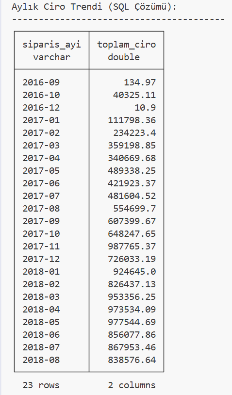
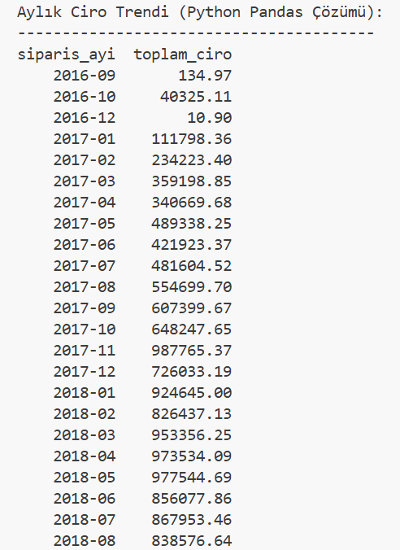
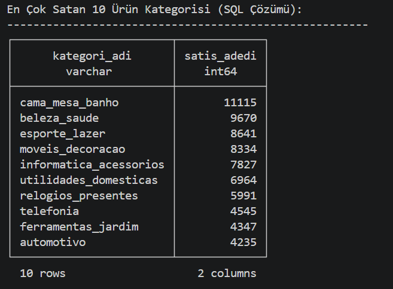
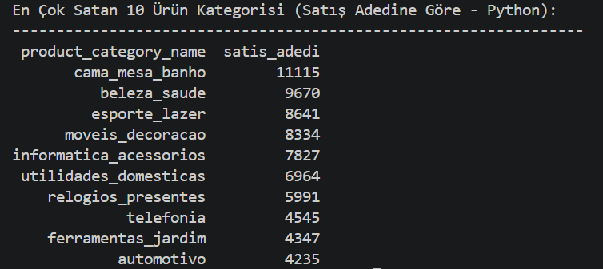

# 📊 Olist E-Ticaret Veri Analizi: SQL ve Python Karşılaştırması

Merhaba! Veri analizi üzerine derinlemesine bir deneyim kazanmak adına, gerçek dünya problemlerini aynı anda hem **SQL** hem de **Python (Pandas)** ile çözerek bu iki güçlü aracı karşılaştırmak istedim. 

Bu projede, veritabanından bilgi çekerken SQL'in, veriyi dönüştürürken ve analiz ederken ise Python'ın nasıl konumlandığını adım adım inceliyoruz.

## 🗂️ Veri Seti: Brazilian E-Commerce Public Dataset by Olist
Kullandığım veri seti, Brezilya'daki birden fazla pazaryerinde gerçekleşen 100 bin siparişe ait gerçek ticari verilerden oluşmaktadır[cite: 4]. Olist Store tarafından sağlanan bu veriler; sipariş durumu, fiyat, müşteri konumu ve ürün özellikleri gibi birçok boyutta analiz yapmaya olanak tanır[cite: 4]. 

---

## 🛠️ Adım 1: Çalışma Ortamını Hazırlama ve Veri Aktarımı (Data Ingestion)

Elimizdeki ham CSV (virgülle ayrılmış değerler) dosyalarını doğrudan analiz etmek yerine, onları SQL ile sorgulayabileceğimiz ilişkisel bir veritabanına aktardık[cite: 4]. 

* **Neden Yaptık?** SQL yazabilmek için verilerin bir veritabanında durması gerekir. Normalde PostgreSQL gibi sistemler kurulur, ancak biz kurulum gerektirmeyen, doğrudan kodun içinde çalışan ve analitik işlemler için çok hızlı olan Local Database olarak **DuckDB** kullandık[cite: 4].
* **Nasıl Yaptık?** Python içerisinden DuckDB'ye `read_csv_auto` fonksiyonunu kullanarak bir SQL komutu gönderdik. Bu sayede CSV'lerin içindeki tarihleri, sayıları ve metinleri otomatik algılayıp `customers`, `orders` ve `order_items` gibi temiz, ilişkisel tablolar oluşturduk[cite: 4].

---

## 📈 Adım 2: Aylık Ciro Trendi Analizi

İlk problemimiz, aylara göre başarılı siparişlerden elde edilen toplam ciroyu bulmaktı. Bu soruyu iki farklı yaklaşımla çözdük.

### SQL Yaklaşımı
SQL kullanarak veritabanına sorduğumuz sorunun mantığı şu şekildeydi[cite: 4]:
* **JOIN (Birleştirme):** Tarih bilgisi `orders`, fiyat bilgisi `order_items` tablosunda olduğu için `order_id` üzerinden birleştirme yaptık[cite: 4].
* **WHERE (Filtreleme):** Sadece `delivered` (teslim edildi) statüsündeki siparişleri hesaba kattık[cite: 4].
* **DATE_TRUNC (Tarih Yuvarlama):** Karmaşık saat verilerini `STRFTIME` ile YYYY-MM (Yıl-Ay) formatına yuvarlayıp gruplanabilir hale getirdik[cite: 4].
* **GROUP BY & SUM:** Aylara göre gruplayıp fiyatları topladık[cite: 4].

### Python (Pandas) Yaklaşımı
SQL'i neden Python içinde çalıştırdık? Çünkü analitik senaryolarda veritabanından SQL ile süzülen veri, görselleştirme için Python'a aktarılır[cite: 4]. Bu köprüyü kurmak güçlü bir endüstri standardıdır[cite: 4]. Python tarafında aynı sonucu şu mantıkla elde ettik:
* SQL'deki `WHERE` filtrelemesini DataFrame maskelemesi ile, `JOIN` işlemini ise `pd.merge()` ile yaptık.
* SQL'deki `DATE_TRUNC` kavramının Python'daki karşılığı olan `to_period('M')` ile tarihleri aylara böldük[cite: 4].
* `groupby()` ve `sum()` ile toplam ciroyu hesapladık[cite: 4].

---

## 🏆 Adım 3: En Çok Satan 10 Ürün Kategorisi

İkinci problemimizde, hangi kategoriden sayıca daha çok ürün satıldığını (satış adedine göre sipariş hacmini) analiz ettik[cite: 4]. Müşteri tercihlerini anlamak için kritik bir metrik olan "satış adedini" bulmak için şu adımları izledik[cite: 4]:

### Mantık ve İşlem Adımları
Hem SQL hem de Python'da aynı kurguyu uyguladık[cite: 4]:
1. **Birleştirme:** `order_items` (satış detayları) tablosu ile `products` (ürün bilgileri) tablosunu `product_id` üzerinden yan yana getirdik[cite: 4].
2. **Gruplama:** Verileri `product_category_name` (kategori adı) bazında kümeler haline getirdik[cite: 4].
3. **Sayma:** Her bir kategori kümesinin içinde kaç adet satılmış ürün olduğunu saydık (SQL'de `COUNT`, Python'da `.size()`)[cite: 4].
4. **Sıralama:** Sonuçları en çok satandan en az satana doğru sıraladık (`ORDER BY DESC` / `sort_values(ascending=False)`) ve sadece en üstteki 10 satırı getirdik[cite: 4].

---
*Bu proje, veri analitiği süreçlerinde SQL'in filtreleme/birleştirme gücü ile Python'ın esnekliğini aynı çatı altında kullanma pratiği olarak geliştirilmiştir.*